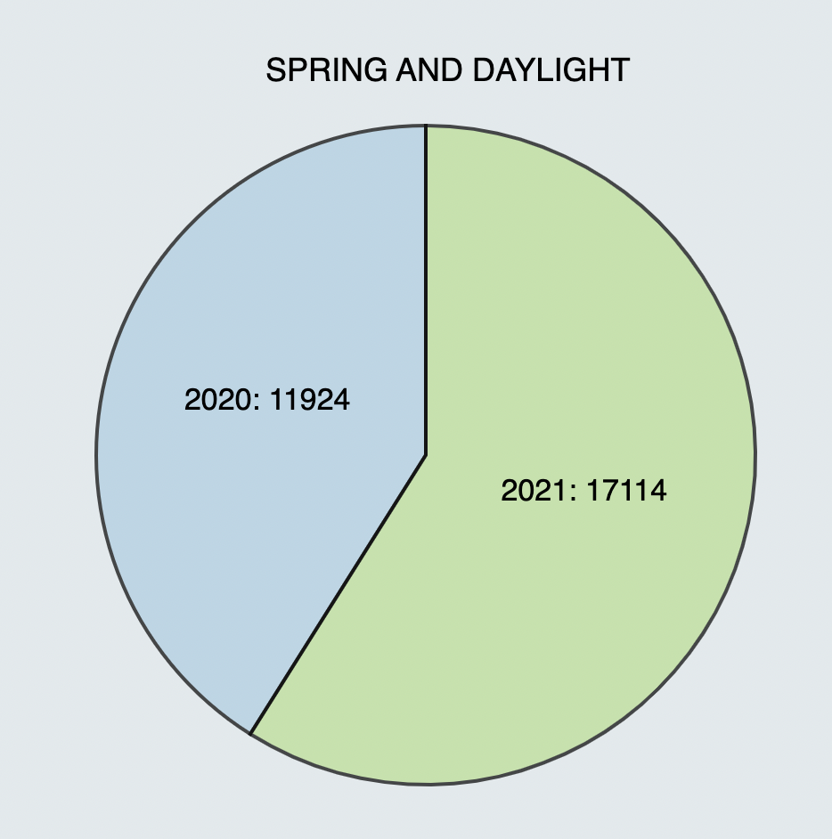

# **Visualization & Visual Analytics Project-2: Traffic Crashes - Crashes**

### **Webpage:** [link](https://anantharohan.github.io/)

## **Authors:**

**Anantha Rohan Parankusham** - 658898154
**Venkata Likith Ayyagari** - 675468655

## **About Dataset:**

The dataset that we have taken is ***‘Traffic Crashes - Crashes’***. Crash data shows information about each traffic crash on city streets within the City of Chicago limits and under the jurisdiction of Chicago Police Department (CPD). Created on October 19, 2017 and is updated daily. For our visualization and analysis, we have taken a subset of this data from January 1st, 2020 to December 31st, 2021 i.e two years. The interactive tool that we have used is D3.js and is executed in Observable.

There were a total of 198692 Crashes after prepocessing like removing null values. Our main analysis was to identify the crashes variation over different seasons in two years. As a result, we have added a new column called seasons. 

## **Domain Question:** 

**How have the seasonal conditions impacted the traffic crashes?** 

Our intention is to identify any significant trends by analyzing crashes based on Lighting and Weather conditions over different seasons. 

## **Pre-processing:**

We had grouped the months into 4 different seasons: **Winter, Spring, Summer and Fall**, and created a column called "CRASH_SEASON". The grouping is done as follows:

* December, January and February - ‘Winter’.
* March, April and May - ‘Spring’.
* June, July and August - ‘Summer’.
* September, October & November - ‘Fall’.

## **Data Question-1:** 

**What are the total number of crashes over each season?** 

**Observable link** - [Question-1](https://observablehq.com/d/067a9d79b4a4ed07)

In this visualization, we plotted a bar chart between Total number of crashes VS Seasons. No interaction.

### **Inference:**

The summer month had most traffic crashes followed by the fall, while spring had the least. This could be because Chicago is considered to be a hotspot for tourists during summer and fall.  Surprisingly, Winter had the least number of crashes as most of us assume that its weather could cause an issue. Following this analysis, we next checked how the lighting conditions have impacted the crashes.

## **Data Question-2:** 

**How did the Lighting conditions affected the crashes over the two year seasons?**

**Observable link** - [Question-2](https://observablehq.com/d/6879551f75834351)

In this visualization, we plotted a stacked bar chart over different lighting conditions. When the user clicks on the stack, they would get a pie chart visualizations over the two years.

### **Inference:**

An interesting fact about this visualization is that most number of accidents took place during daylight over all seasons. DUSK, DAWN and other lighting conditions haven't shown a major impact on the total number of crashes. And irrespective of the lighting conditions, the year 2020 had more number of accidents than that of 2021. This is suprising considering the covid lockdown. 

## **Data Question-3:** 

**How did the Weather conditions affect the crashes?**

**Observable link** - [Question-3](https://observablehq.com/d/c43447debb8e0d62)

In this visualization, we plotted a line chart over different weather conditions. We have included a dropdown for the user to select the weather and we could see the trend of its impact over the seasons.

### **Inference:**

Most of the crashes took place when the weather was clear. On the other hand, Rain had almost equal impact over all the seasons.

## **Data Question-4:** 

**How did the crashes changed over months and hour of the day?**

**Observable link** - [Question-4](https://observablehq.com/d/b03b383d323e15e3)

In this visualization, we plotted a bar graph over different months and when the user clicks on any of the bars, the respective month's crashes per hour of the day line graph shows up. 

### **Inference:**

July and August have more number of crashes, and irrespective of the month, most of the crashes took place in the evenings (Around 14th - 18th hour)

## **Data Question-5:** 

**Which Zipcode had more number of crashes?**

**Observable link** - [Question-5](https://observablehq.com/d/0b55a7c449773e94)

In this visualization, we plotted a choropleth chicago map based on total number of crashes(people) at each zipcode.

### **Inference:**

Most number of crashes took place at 60629 with a total of 10406 crashes in 2 years.

## Conclusion 

As per our analysis, Lighting and Weather conditions haven't had major impact on the traffic crashes. The trends were almost similar over the seasons and the two years of the data. Perhaps, the major take would be to be careful during the months of summer/fall as most crashes took place during these months. 
